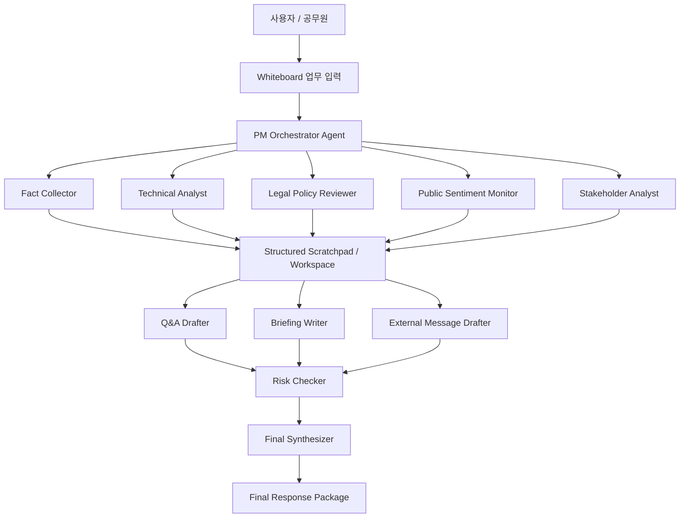
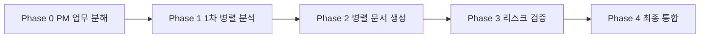

# 현안 대응 패키지 자동 생성 멀티에이전트 프로젝트 개발 플랜

> VSCode + Codex 기반 개발 착수용 문서
> 적용 주제: **가상 공공서비스 예약시스템 장애 발생 대응 패키지 자동 생성**
> 활용 도구: **PixelAgentOS 기반 시각화 멀티에이전트 시뮬레이션 + 하네스 구조**

---

## 1. 프로젝트 목적

이 프로젝트의 목적은 공무원의 실제 현안 대응 업무를 멀티에이전트 방식으로 시뮬레이션하고, 그 처리 과정을 시각적으로 보여주는 것이다.

단순히 보고서를 자동 생성하는 것이 아니라, 실제 부처에서 현안이 발생했을 때 여러 담당자가 동시에 움직이는 구조를 AI 에이전트로 재현한다.

### 핵심 목표

1. **공무원 현안 대응 업무의 병렬 처리 구조 구현**
   - 사실관계 확인
   - 법령·제도 검토
   - 기술·원인 분석
   - 민원·언론·국회 리스크 분석
   - 예상 질의응답 작성
   - 간부 보고자료 작성
   - 대외 설명자료 작성
   - 최종 리스크 검증

2. **PixelAgentOS를 활용한 시각적 시뮬레이션**
   - 각 에이전트가 픽셀 오피스에서 역할별로 일하는 모습을 보여준다.
   - PM 에이전트가 업무를 분해하고, 여러 에이전트가 병렬 처리하는 모습을 실시간으로 표시한다.
   - 최종 산출물을 Filing Cabinet 또는 deliverables 영역에서 확인할 수 있게 한다.

3. **실제 업무에 적용 가능한 하네스 설계**
   - 한 번성 데모가 아니라 향후 국회 대응, 민원 대응, 보도 대응, 감사 대응, 회의자료 작성 등으로 확장 가능한 구조를 만든다.
   - 모든 산출물은 중간 판단과 근거가 남도록 파일 또는 scratchpad에 기록한다.

4. **공공 업무에 필요한 통제 원칙 반영**
   - 없는 사실을 만들지 않는다.
   - 출처, 기준일, 가정, 한계를 분리한다.
   - 법령·정책·표현 리스크를 별도로 검증한다.
   - 개인정보, 비공개 정보, 실제 내부자료를 데모에 사용하지 않는다.

---

## 2. 프로젝트가 지향하지 않는 것

이 프로젝트가 잘못된 방향으로 확장되지 않도록 다음 사항을 명확히 제외한다.

### 하지 않는 것

- 실제 행정 의사결정을 자동화하지 않는다.
- 실제 민원, 국회자료, 내부 문서, 개인정보를 데모 데이터로 사용하지 않는다.
- 공식 대외 입장, 보도자료, 답변서를 자동 발송하지 않는다.
- 법률 자문이나 최종 적법성 판단을 AI가 대체하지 않는다.
- 단순 챗봇 형태의 질의응답 시스템으로 축소하지 않는다.
- 단일 에이전트가 순차적으로 모든 일을 처리하는 구조로 만들지 않는다.
- “그럴듯한 문서 생성”만을 목표로 하지 않는다.

### 반드시 지켜야 할 방향

- **멀티에이전트**
- **병렬 처리**
- **역할별 책임 분리**
- **시각화된 진행상황**
- **근거 기반 산출물**
- **최종 검증 루프**
- **공무원 업무 시뮬레이션**

---

## 3. 이번 달 적용 주제

## 가상 공공서비스 예약시스템 장애 발생 대응 패키지 자동 생성

### 시나리오 개요

가상의 전국 공공서비스 예약시스템에서 오전 9시부터 11시까지 접속 장애가 발생했다.
국민 민원이 증가하고 언론 문의 및 국회 질의 가능성이 제기되는 상황을 가정한다.

AI 멀티에이전트 팀은 이 상황을 접수한 뒤, 여러 업무를 병렬로 수행하여 최종 대응 패키지를 만든다.

### 데모 입력 프롬프트

```text
전국 공공서비스 예약시스템이 오전 9시부터 11시까지 접속 장애를 겪었다는 민원이 다수 발생했다.
언론 문의와 국회 질의 가능성에 대비해 현안 대응 패키지를 만들어줘.
보고 대상은 실장급이고, 대외 설명자료와 예상 Q&A도 포함해줘.
실제 기관명이나 실제 개인정보는 사용하지 말고, 가상 상황으로 작성해줘.
```

### 이 주제를 선택한 이유

| 기준 | 적합성 | 설명 |
|---|---:|---|
| 병렬 처리 | 매우 높음 | 사실관계, 원인분석, 법령검토, 여론분석, Q&A 작성이 동시에 가능 |
| 시각화 효과 | 매우 높음 | 상황실처럼 여러 에이전트가 동시에 움직이는 모습을 보여주기 좋음 |
| 행정업무 적합성 | 매우 높음 | 실제 부처의 현안 대응, 간부 보고, 대외 설명 업무와 유사 |
| 보안성 | 높음 | 가상 시나리오로 구성 가능 |
| 확장성 | 높음 | 국회 대응, 민원 대응, 보도 대응, 감사 대응으로 확장 가능 |

---

## 4. 전체 시스템 개념

이 프로젝트는 다음 세 계층으로 구성한다.



### 핵심 구조

1. **PM Orchestrator**
   - 사용자 요청을 분석한다.
   - subtasks로 분해한다.
   - 병렬 처리 가능한 업무와 의존성이 있는 업무를 구분한다.
   - 산출물을 검토하고 최종 통합을 지시한다.

2. **Worker Agents**
   - 각자 전문 역할을 맡는다.
   - 병렬로 자료를 수집·분석·작성한다.
   - 결과를 scratchpad 또는 workspace에 저장한다.

3. **Structured Scratchpad / Workspace**
   - 에이전트 간 공유 공간이다.
   - 중간 산출물, 근거, 판단, 한계, 수정 요청을 저장한다.
   - 최종 결과물의 추적 가능성을 보장한다.

4. **Risk Checker**
   - 사실 오류, 법령 충돌, 표현 리스크, 개인정보, 비공개 정보 포함 여부를 점검한다.

5. **Final Synthesizer**
   - 개별 산출물을 하나의 현안 대응 패키지로 통합한다.

---

## 5. PixelAgentOS 활용 방향

### 활용 목적

PixelAgentOS는 단순 실행 엔진이 아니라, “공무원 업무 처리 상황실”을 보여주는 시각화 계층으로 활용한다.

### 화면에서 보여줄 장면

| 장면 | 설명 |
|---|---|
| 에이전트 채용 | 역할별 에이전트를 책상에 배치 |
| Whiteboard 입력 | 가상 현안 대응 과제 등록 |
| PM 업무 분해 | PM이 subtasks와 의존관계를 생성 |
| 병렬 실행 | 여러 담당 에이전트가 동시에 작업 |
| 에이전트 간 통신 | scratchpad 공유, 메시지 교환, 도움 요청 |
| PM 리뷰 | 산출물 pass / minor / fail 검토 |
| 최종 산출물 확인 | Filing Cabinet 또는 deliverables에서 대응 패키지 확인 |

### PixelAgentOS 매핑

| 프로젝트 요소 | PixelAgentOS 요소 |
|---|---|
| PM Orchestrator | PM Agent |
| 업무 담당 에이전트 | Worker Agents |
| `_workspace/*.md` | Scratchpad / Deliverables |
| 업무별 하네스 | Skill System |
| 최종 대응 패키지 | Filing Cabinet / Final Deliverable |
| 병렬 실행 상태 | Pixel Office status animation |
| 에이전트 간 협업 | Agent-to-Agent communication |

---

## 6. 멀티에이전트 구성

### 6.1 PM Orchestrator

| 항목 | 내용 |
|---|---|
| 역할 | 전체 업무 분해, 배정, 진행관리, 리뷰 |
| 입력 | 사용자 요청, 시나리오 조건 |
| 출력 | 작업 분해표, 의존성 그래프, 최종 검토 지시 |
| 핵심 원칙 | 순차 업무가 아니라 병렬 업무 중심으로 설계 |
| 금지사항 | 모든 작업을 단일 에이전트에게 몰아주지 않음 |

### 6.2 Fact Collector

| 항목 | 내용 |
|---|---|
| 역할 | 사실관계와 타임라인 정리 |
| 주요 작업 | 발생 시각, 영향 범위, 민원 건수, 조치 현황 정리 |
| 출력 | `01_fact_timeline.md` |
| 주의사항 | 확인된 사실, 가정, 미확인 사항을 분리 |

### 6.3 Technical Analyst

| 항목 | 내용 |
|---|---|
| 역할 | 기술 원인과 시스템 영향 분석 |
| 주요 작업 | 장애 원인 가설, 임시 조치, 재발방지 대책 정리 |
| 출력 | `02_technical_analysis.md` |
| 주의사항 | 원인 확정 전에는 단정 표현 금지 |

### 6.4 Legal Policy Reviewer

| 항목 | 내용 |
|---|---|
| 역할 | 법령·지침·제도상 검토 |
| 주요 작업 | 관련 법령, 서비스 운영 책임, 고지 의무, 표현 수위 검토 |
| 출력 | `03_legal_policy_review.md` |
| 주의사항 | 법률 자문처럼 단정하지 않고 검토 필요사항을 분리 |

### 6.5 Public Sentiment Monitor

| 항목 | 내용 |
|---|---|
| 역할 | 민원·언론·국회 반응 예상 |
| 주요 작업 | 주요 불만 유형, 언론 질의 포인트, 국회 예상 쟁점 정리 |
| 출력 | `04_public_sentiment.md` |
| 주의사항 | 실제 여론 수치가 없으면 가상 시나리오임을 명시 |

### 6.6 Stakeholder Analyst

| 항목 | 내용 |
|---|---|
| 역할 | 이해관계자 영향 분석 |
| 주요 작업 | 국민, 지자체, 위탁기관, 국회, 언론 영향 분석 |
| 출력 | `05_stakeholder_impact.md` |
| 주의사항 | 이해관계자별 대응 메시지를 구분 |

### 6.7 Q&A Drafter

| 항목 | 내용 |
|---|---|
| 역할 | 예상 질의응답 작성 |
| 주요 작업 | 국회, 언론, 민원 관점의 예상 Q&A 작성 |
| 출력 | `06_expected_qna.md` |
| 주의사항 | 책임 인정, 원인 단정, 보상 약속 등 민감 표현 검토 필요 |

### 6.8 Briefing Writer

| 항목 | 내용 |
|---|---|
| 역할 | 실장급 간부 보고자료 작성 |
| 주요 작업 | 1페이지 보고, 상황 개요, 조치 현황, 리스크, 향후 계획 작성 |
| 출력 | `07_executive_brief.md` |
| 주의사항 | 결론 먼저, 판단 필요사항 명확화 |

### 6.9 External Message Drafter

| 항목 | 내용 |
|---|---|
| 역할 | 대외 설명자료와 국민 안내문 작성 |
| 주요 작업 | 안내문, 언론 대응 메시지, 홈페이지 공지 초안 작성 |
| 출력 | `08_external_message.md` |
| 주의사항 | 사과, 책임, 보상, 재발방지 표현 수위 관리 |

### 6.10 Risk Checker

| 항목 | 내용 |
|---|---|
| 역할 | 전체 산출물 교차 검증 |
| 주요 작업 | 사실관계, 법령, 표현, 보안, 개인정보, 정책정합성 검토 |
| 출력 | `09_risk_check.md` |
| 주의사항 | 문제를 심각도별로 분류 |

### 6.11 Final Synthesizer

| 항목 | 내용 |
|---|---|
| 역할 | 최종 대응 패키지 통합 |
| 주요 작업 | 개별 산출물 통합, 중복 제거, 최종 제출본 구성 |
| 출력 | `10_final_package.md` |
| 주의사항 | 검증 미통과 항목은 최종본에 반영하지 않음 |

---

## 7. 병렬 처리 설계

### 처리 단계



### Phase 0. PM 업무 분해

- 사용자 요청을 구조화한다.
- 최종 산출물 목록을 확정한다.
- 병렬 가능 업무와 의존성 있는 업무를 분리한다.
- 각 에이전트별 acceptance criteria를 설정한다.

### Phase 1. 1차 병렬 분석

동시에 실행한다.

```text
Fact Collector
Technical Analyst
Legal Policy Reviewer
Public Sentiment Monitor
Stakeholder Analyst
```

### Phase 2. 병렬 문서 생성

Phase 1 결과를 참고해 동시에 실행한다.

```text
Q&A Drafter
Briefing Writer
External Message Drafter
```

### Phase 3. 리스크 검증

```text
Risk Checker
PM Review
```

검증 결과는 다음 등급으로 분류한다.

| 등급 | 의미 | 조치 |
|---|---|---|
| 🔴 필수 수정 | 사실 오류, 법령 충돌, 개인정보, 공식입장 오인 위험 | 즉시 수정 |
| 🟡 권장 수정 | 표현 수위, 근거 부족, 논리 약점 | 가능하면 수정 |
| 🟢 참고 | 가독성, 형식, 추가 보완 | 선택 반영 |

### Phase 4. 최종 통합

- 최종 보고자료
- 예상 Q&A
- 대외 설명자료
- 리스크 검토 결과
- 후속 조치 목록

을 하나의 패키지로 통합한다.

---

## 8. 산출물 구조

### Workspace 구조

```text
_workspace/
├── 00_issue_intake.md
├── 01_fact_timeline.md
├── 02_technical_analysis.md
├── 03_legal_policy_review.md
├── 04_public_sentiment.md
├── 05_stakeholder_impact.md
├── 06_expected_qna.md
├── 07_executive_brief.md
├── 08_external_message.md
├── 09_risk_check.md
└── 10_final_package.md
```

### 최종 패키지 구성

`10_final_package.md`는 다음 구조로 작성한다.

```markdown
# 현안 대응 패키지

## 1. 상황 개요
## 2. 주요 사실관계
## 3. 영향 범위
## 4. 원인 및 조치 현황
## 5. 법령·제도 검토
## 6. 주요 리스크
## 7. 실장급 보고자료
## 8. 예상 Q&A
## 9. 대외 설명자료
## 10. 후속 조치 계획
## 11. 검증 결과 및 유의사항
```

---

## 9. 하네스 디렉토리 설계

### 목표 구조

```text
.claude/
├── agents/
│   ├── pm-orchestrator.md
│   ├── fact-collector.md
│   ├── technical-analyst.md
│   ├── legal-policy-reviewer.md
│   ├── public-sentiment-monitor.md
│   ├── stakeholder-analyst.md
│   ├── qna-drafter.md
│   ├── briefing-writer.md
│   ├── external-message-drafter.md
│   ├── risk-checker.md
│   └── final-synthesizer.md
├── skills/
│   └── incident-response-package/
│       └── skill.md
└── CLAUDE.md
```

### `CLAUDE.md`에 반드시 포함할 내용

- 프로젝트 목적
- 적용 범위
- 제외 범위
- 에이전트 구성
- 병렬 처리 원칙
- workspace 산출물 구조
- 검증 기준
- 보안 및 개인정보 제한
- 데모 시나리오

### `skill.md`에 반드시 포함할 내용

- 트리거 조건
- 업무 모드
- Phase별 실행 순서
- 병렬 실행 대상
- 의존성 규칙
- 에러 처리
- 최종 산출물 기준
- 테스트 시나리오

---

## 10. VSCode + Codex 개발 플랜

## 10.1 개발 기본 원칙

Codex에는 항상 다음 원칙을 명확히 전달한다.

```text
이 프로젝트는 공무원 현안 대응 업무를 시각화된 멀티에이전트 병렬처리로 시뮬레이션하는 PoC이다.
단순 챗봇이나 단일 보고서 생성기가 아니다.
PixelAgentOS를 활용해 PM이 업무를 분해하고, 여러 에이전트가 동시에 작업하며, 최종 대응 패키지를 생성하는 모습을 보여주는 것이 핵심이다.
```

## 10.2 VSCode 작업 순서

### Step 1. 저장소 준비

```bash
git clone https://github.com/evanbian/PixelAgentOS.git
cd PixelAgentOS
code .
```

### Step 2. 실행 환경 확인

```bash
cp backend/.env.example backend/.env
```

`.env`에 사용할 LLM API 키를 설정한다.

```env
OPENAI_API_KEY=...
ANTHROPIC_API_KEY=...
DEEPSEEK_API_KEY=...
TAVILY_API_KEY=...
```

실제 사용할 키만 설정한다.

### Step 3. 로컬 실행

```bash
./start.sh
```

브라우저에서 다음 주소를 연다.

```text
http://localhost:5173
```

### Step 4. 현재 구조 파악

Codex에 다음 작업을 요청한다.

```text
PixelAgentOS 코드베이스를 분석해줘.
특히 PM Agent, Worker Agent, Scratchpad, Skill System, Deliverables, Whiteboard Task, WebSocket 이벤트 흐름이 어디에서 정의되는지 찾아줘.
분석 결과는 docs/codebase-map.md로 정리해줘.
```

### Step 5. 역할별 에이전트 프리셋 설계

Codex에 다음 작업을 요청한다.

```text
공무원 현안 대응 시나리오에 맞는 agent role preset을 추가하려고 한다.
다음 역할을 PixelAgentOS의 agent role 또는 system prompt 구조에 맞게 추가할 수 있는 위치를 찾아줘.

- PM Orchestrator
- Fact Collector
- Technical Analyst
- Legal Policy Reviewer
- Public Sentiment Monitor
- Stakeholder Analyst
- Q&A Drafter
- Briefing Writer
- External Message Drafter
- Risk Checker
- Final Synthesizer

직접 코드를 수정하기 전에 변경 계획을 docs/agent-role-plan.md로 작성해줘.
```

### Step 6. 하네스 파일 추가

Codex에 다음 작업을 요청한다.

```text
프로젝트 루트에 .claude 하네스 구조를 추가해줘.
목표 구조는 다음과 같다.

.claude/
├── agents/
├── skills/incident-response-package/
└── CLAUDE.md

각 agent md 파일에는 역할, 입력, 출력, 작업 원칙, 금지사항, 검증 기준, 에러 처리를 포함해줘.
skills/incident-response-package/skill.md에는 병렬 처리 workflow, phase, 산출물 구조, 테스트 시나리오를 포함해줘.
```

### Step 7. 샘플 시나리오 추가

Codex에 다음 작업을 요청한다.

```text
가상 공공서비스 예약시스템 장애 발생 대응 데모 시나리오를 추가해줘.
실제 기관명, 실제 시스템명, 개인정보는 사용하지 않는다.
demo/incident-response/sample-task.md에 Whiteboard에 입력할 프롬프트를 작성해줘.
demo/incident-response/expected-deliverables.md에는 기대 산출물 목록을 작성해줘.
```

### Step 8. 병렬 실행 확인

Codex에 다음 작업을 요청한다.

```text
PixelAgentOS에서 PM이 task를 decompose할 때 병렬 실행 가능한 subtasks가 dependency 없이 생성되는지 확인해줘.
이번 시나리오에서는 Phase 1의 다음 5개 작업이 병렬 실행되어야 한다.

- fact collection
- technical analysis
- legal policy review
- public sentiment monitoring
- stakeholder analysis

해당 구조가 코드상 어떻게 표현되는지 확인하고, 필요하면 최소 수정안을 제안해줘.
```

### Step 9. 시각화 상태 강화

Codex에 다음 작업을 요청한다.

```text
각 에이전트의 작업 상태가 화면에서 명확히 보이도록 status label 또는 task title 표시 방식을 개선할 수 있는지 확인해줘.
목표는 데모 중 관찰자가 각 픽셀 에이전트가 무슨 일을 하는지 알 수 있게 하는 것이다.
가능하면 agent card 또는 sprite 주변에 현재 subtask명을 표시하는 최소 수정안을 제안해줘.
```

### Step 10. 최종 산출물 확인

Codex에 다음 작업을 요청한다.

```text
최종 산출물이 Filing Cabinet 또는 deliverables에서 다음 파일 구조로 확인되도록 구성해줘.

00_issue_intake.md
01_fact_timeline.md
02_technical_analysis.md
03_legal_policy_review.md
04_public_sentiment.md
05_stakeholder_impact.md
06_expected_qna.md
07_executive_brief.md
08_external_message.md
09_risk_check.md
10_final_package.md

실제 구현이 어렵다면 현재 deliverable 구조에 맞춰 가장 유사한 방식으로 매핑해줘.
```

---

## 11. Codex용 상위 지시문

VSCode에서 Codex에게 프로젝트 전반을 설명할 때 다음 지시문을 사용한다.

```text
이 프로젝트는 PixelAgentOS를 기반으로 공무원 현안 대응 업무를 멀티에이전트 병렬처리로 시각화하는 PoC이다.

핵심 주제는 “가상 공공서비스 예약시스템 장애 발생 대응 패키지 자동 생성”이다.

목표는 단순 보고서 생성이 아니다.
PM 에이전트가 업무를 분해하고, 여러 전문 에이전트가 동시에 작업하고, scratchpad를 통해 중간 산출물을 공유하며, Risk Checker가 사실·법령·표현 리스크를 검증하고, Final Synthesizer가 최종 대응 패키지를 만드는 과정을 화면으로 보여주는 것이다.

반드시 지켜야 할 원칙:
1. 단일 에이전트 순차처리가 아니라 병렬 멀티에이전트 구조로 설계한다.
2. 실제 기관명, 실제 개인정보, 실제 내부자료는 사용하지 않는다.
3. 없는 사실을 만들지 않는다. 가상 데이터는 가상임을 명시한다.
4. 법령·사실·표현 리스크 검증 단계를 반드시 둔다.
5. 최종 산출물은 실장급 보고자료, 예상 Q&A, 대외 설명자료, 리스크 검토 결과를 포함한다.
6. 화면에서 각 에이전트가 어떤 업무를 수행 중인지 관찰 가능해야 한다.
7. 이번 달 목표는 범용 시스템 완성이 아니라, 하나의 명확한 현안 대응 시나리오를 통해 병렬처리와 시각화 가능성을 입증하는 것이다.
```

---

## 12. 개발 마일스톤

### Milestone 1. 코드베이스 이해

| 작업 | 산출물 |
|---|---|
| PixelAgentOS 실행 | 로컬 실행 확인 |
| PM / Worker / Scratchpad 구조 파악 | `docs/codebase-map.md` |
| task decomposition 구조 파악 | `docs/orchestration-analysis.md` |

### Milestone 2. 하네스 설계

| 작업 | 산출물 |
|---|---|
| `.claude` 구조 추가 | `.claude/CLAUDE.md` |
| 역할별 agent md 작성 | `.claude/agents/*.md` |
| incident response skill 작성 | `.claude/skills/incident-response-package/skill.md` |

### Milestone 3. PixelAgentOS 매핑

| 작업 | 산출물 |
|---|---|
| 역할 프리셋 추가 | agent role config |
| demo task 추가 | `demo/incident-response/sample-task.md` |
| 산출물 매핑 | deliverables 구조 |

### Milestone 4. 병렬 처리 검증

| 작업 | 산출물 |
|---|---|
| Phase 1 병렬 실행 확인 | 실행 로그 |
| 에이전트 간 scratchpad 공유 확인 | scratchpad 기록 |
| PM review loop 확인 | review 결과 |

### Milestone 5. 데모 완성

| 작업 | 산출물 |
|---|---|
| 데모 스크립트 작성 | `demo/incident-response/demo-script.md` |
| 최종 산출물 샘플 생성 | `demo/incident-response/output-sample/` |
| 평가표 작성 | `docs/evaluation-result.md` |

---

## 13. 데모 성공 기준

### 기능 기준

- [ ] 사용자가 Whiteboard에 가상 현안을 입력할 수 있다.
- [ ] PM이 최소 8개 이상의 subtasks로 업무를 분해한다.
- [ ] Phase 1에서 최소 5개 업무가 병렬 실행된다.
- [ ] 각 에이전트의 역할과 현재 작업이 화면에서 식별된다.
- [ ] scratchpad 또는 workspace에 중간 산출물이 남는다.
- [ ] Risk Checker가 최종 검증 보고서를 만든다.
- [ ] Final Synthesizer가 최종 대응 패키지를 생성한다.

### 업무 품질 기준

- [ ] 사실관계와 가정이 구분되어 있다.
- [ ] 법령·제도 검토 항목이 포함되어 있다.
- [ ] 언론·국회·민원 예상 쟁점이 포함되어 있다.
- [ ] 실장급 보고자료가 포함되어 있다.
- [ ] 예상 Q&A가 포함되어 있다.
- [ ] 대외 설명자료가 포함되어 있다.
- [ ] 개인정보·비공개 정보가 포함되지 않는다.
- [ ] 단정적 책임 인정 표현이 검토된다.

### 시각화 기준

- [ ] 관찰자가 화면만 보고도 여러 에이전트가 동시에 일하는 것을 이해할 수 있다.
- [ ] PM이 업무를 분해하고 검토하는 모습이 드러난다.
- [ ] 에이전트 간 통신 또는 산출물 공유가 관찰된다.
- [ ] 최종 산출물을 UI에서 확인할 수 있다.

---

## 14. 리스크와 대응

| 리스크 | 내용 | 대응 |
|---|---|---|
| PixelAgentOS가 초기 단계 | 기능이 불안정하거나 구현 변경 가능 | 최소 수정, 데모 범위 제한 |
| 병렬 실행이 실제로 제한될 수 있음 | 내부 orchestration이 순차적으로 동작할 가능성 | UI상 병렬 task 구조와 로그 기준으로 검증 |
| 산출물 품질 편차 | LLM 결과가 매번 달라질 수 있음 | system prompt, acceptance criteria, output template 강화 |
| 공공업무 표현 리스크 | 과도한 단정, 책임 인정 표현 가능 | Risk Checker 필수화 |
| 보안 오해 | 실제 업무자료 처리로 오인 가능 | 모든 데모는 가상 시나리오로 제한 |
| 범용화 과욕 | 첫 달부터 모든 업무 처리로 확대될 위험 | 이번 달은 현안 대응 PoC로 제한 |

---

## 15. 향후 확장 방향

이번 달 PoC가 성공하면 다음 업무 유형으로 확장한다.

```text
1. 국회 요구자료 대응 하네스
2. 민원 다발 이슈 대응 하네스
3. 보도자료 및 브리핑 대응 하네스
4. 감사·점검 대응 하네스
5. 회의자료 사전 준비 하네스
6. 정책 발표 전 리스크 점검 하네스
7. 성과관리 및 KPI 보고 하네스
```

공통 구조는 유지한다.

```text
PM 분해
→ 병렬 전문 에이전트 처리
→ scratchpad 공유
→ 교차 검증
→ 최종 산출물 통합
→ PixelAgentOS 시각화
```

---

## 16. 최종 정리

이 프로젝트의 핵심은 다음 한 문장으로 요약된다.

> **공무원이 현안 발생 시 여러 담당자와 협업해 대응자료를 만드는 실제 업무 흐름을, PixelAgentOS 기반 멀티에이전트 병렬처리 시뮬레이션으로 구현한다.**

이번 달 목표는 완성형 범용 행정 AI가 아니다.

이번 달 목표는 다음 하나를 명확히 입증하는 것이다.

> **가상의 공공서비스 장애 현안을 입력하면, 여러 전문 에이전트가 동시에 움직이며 사실관계, 법령검토, 여론·국회 리스크, 보고자료, Q&A, 대외문안, 리스크 검증을 수행하고 최종 대응 패키지를 생성하는 모습을 눈으로 보여준다.**

---

## 17. 참고 저장소

- PixelAgentOS: https://github.com/evanbian/PixelAgentOS
- Harness 100 Report Generator 예시: https://github.com/revfactory/harness-100/tree/main/ko/82-report-generator/.claude
